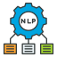

# AWS Academy: Submission

| No  | Name  | Cloud Foundations | Cloud Architecting | Data Engineering | ML for NLP |
| ---: | ------------- | :-------------: | :-------------: | :-------------: | :-------------: | 
| 0   | ADAM WAFII BIN AZUAR                      |  |  | | |
| 1   | ISMAIL MAEEN                           |  |  |  | | 
| 2  | NUR AZIMAH BINTI MOHD SALLEH           | 
| 3  | NURUL WAHIEDA BINTI MUHAMMAD FARID SELLEKUMAR  |
| 4  | PANG CHERN HONG                        |   |  | | |
| 5  | RANJEET A/L THIAGARAJAN                | |  | | |
| 6  | MUSAB IBNE AHMAD                        |

