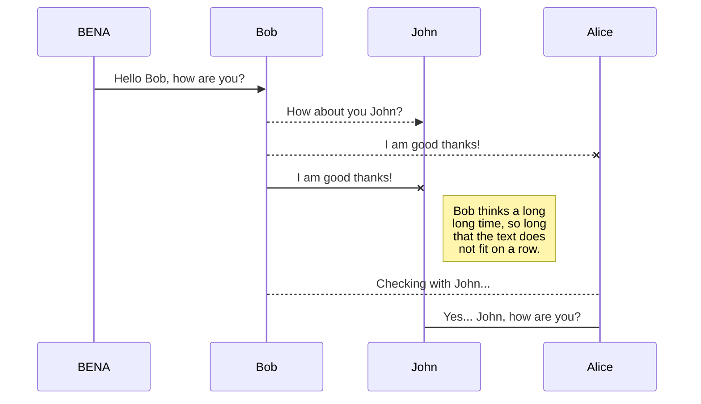
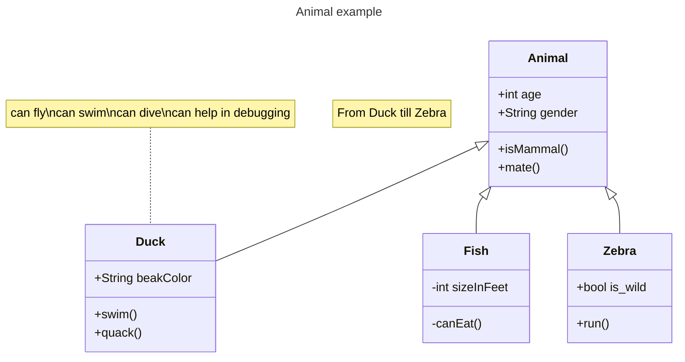

Hi! I'm your first Markdown file in **StackEdit**. If **you want** to learn about StackEdit, you can read me. If you want to play with Markdown, you can edit me. Once you have finished with me, *you can* *create* new files by opening the **file explorer** on the left corner of the navigation bar.

# Publication

Publishing in StackEdit makes it simple for you to publish online your files. Once you're happy with a file, you can publish it to different hosting platforms like **Blogger**, **Dropbox**, **Gist**, **GitHub**, **Google Drive**, **WordPress** and **Zendesk**. With [Handlebars templates](http://handlebarsjs.com/), you have full control over what you export.

[BENA](https://youtu.be/wwLHsXbSa-Y?si=ska7Cyr3Y3Q5HM2h)


## UML diagrams

You can render UML diagrams using [Mermaid](https://mermaidjs.github.io/). For example, this will produce a sequence diagram:



```
journey
    title My working day
    section Go to work
      Make tea: 5: Me
      Go upstairs: 3: Me
      Do work: 1: Me, Cat
    section Go home
      Go downstairs: 5: Me
      Sit down: 5: Me
```
