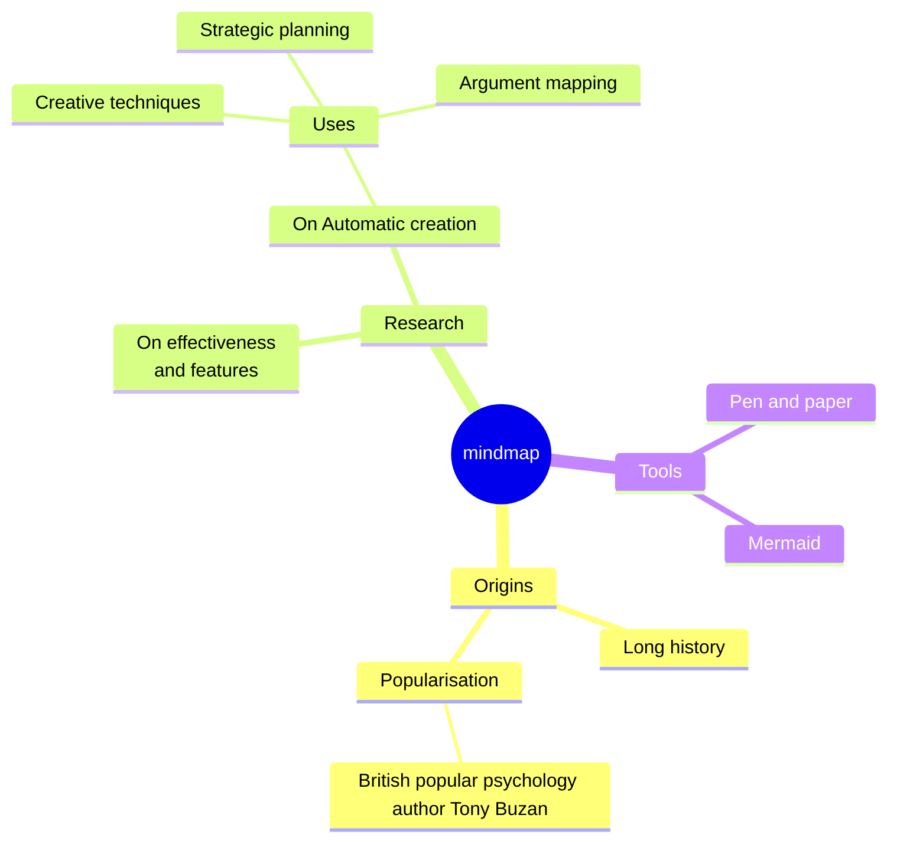
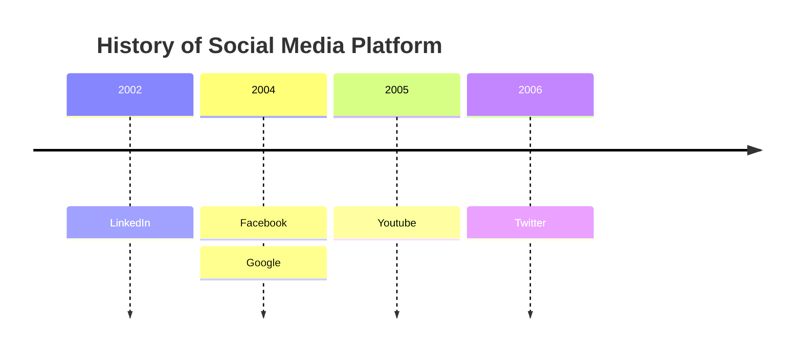

For lecturers and academics, GitHub Education offers a range of resources to help them teach technology skills, including Lesson Plans, Classroom Tools, and Professional Development resources. These resources are designed to help teachers create and deliver effective technology courses and programs, and to help students develop the skills they need to succeed in the technology industry.

[a film link](https://www.youtube.com/live/86ZkbwYi1PI?feature=shared)
## UML diagrams

You can render UML diagrams using [Mermaid](https://mermaidjs.github.io/). For example, this will produce a sequence diagram:

And this will produce a flow chart:

## UML diagrams

You can render UML diagrams using [Mermaid](https://mermaidjs.github.io/). For example, this will produce a sequence diagram:

And this will produce a flow chart:

## UML diagrams

You can render UML diagrams using [Mermaid](https://mermaidjs.github.io/). For example, this will produce a sequence diagram:

And this will produce a flow chart:

**my working day**

## UML diagrams

You can render UML diagrams using [Mermaid](https://mermaidjs.github.io/). For example, this will produce a sequence diagram:

And this will produce a flow chart:

