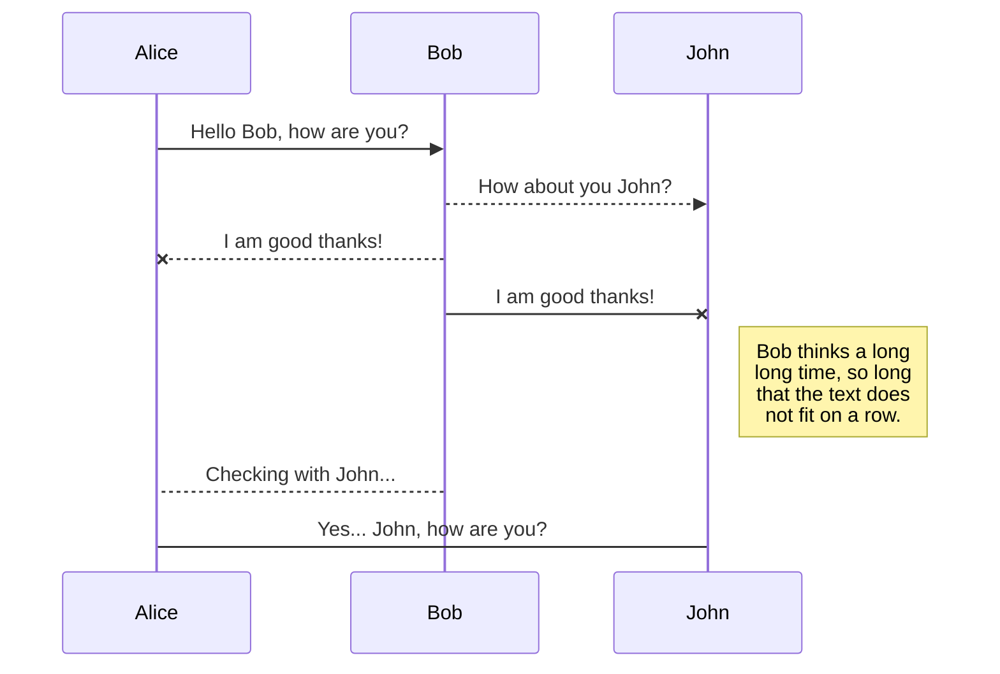
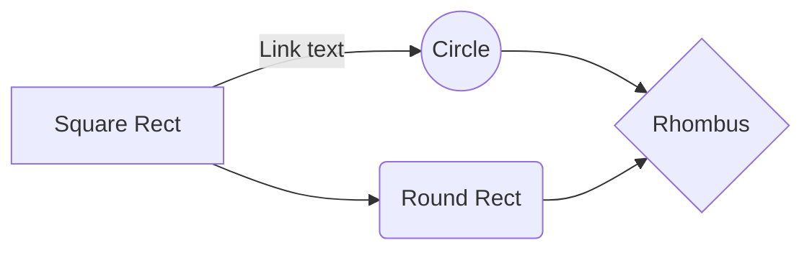
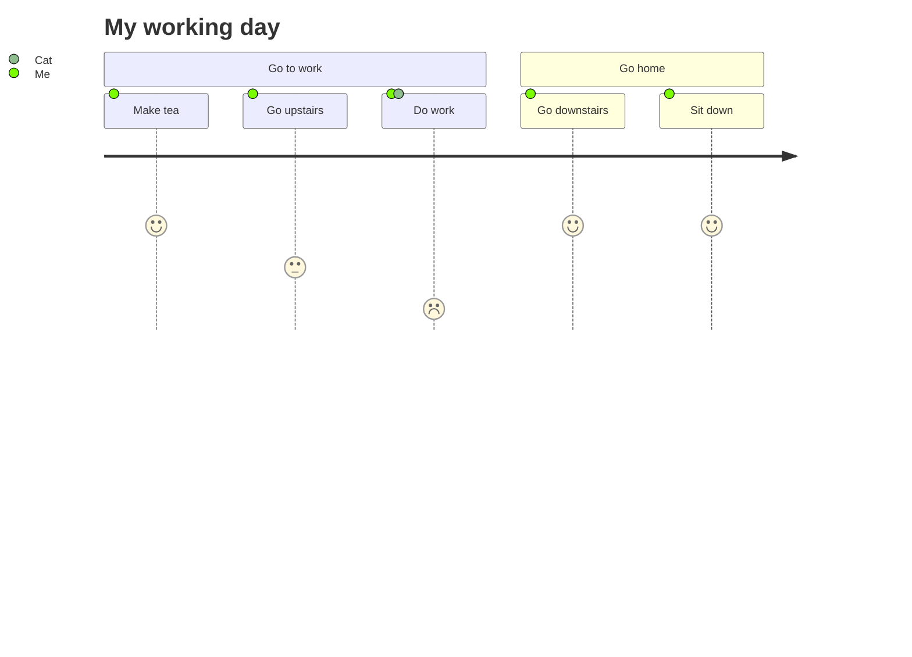

# Hello World
## Hello World
### Hello World
#### Hello World

My name  **Norazhar Anas**, I'm *43 years old*
| Header 1 | Header 2 | Header 3 |
|----------|----------|----------|
| Row 1, Col 1 | Row 1, Col 2 | Row 1, Col 3 |
| Row 2, Col 1 | Row 2, Col 2 | Row 2, Col 3 |
| Row 3, Col 1 | Row 3, Col 2 | Row 3, Col 3 |

| Name            | IC Number    | Gender | Age | Address                           |
|-----------------|--------------|:--------:|-----:|-----------------------------------|
| Ahmad bin Ali   | 950201-14-5678| Male   | 30  | 123 Jalan Merdeka, Kuala Lumpur   |
| Siti binti Tan  | 881011-08-9876| Female | 25  | 456 Jalan Bunga Raya, Penang      |
| Hafizah bt Lim  | 900505-12-3456| Female | 32  | 789 Jalan Damai, Johor Bahru      |
| Amirul bin Raju | 970719-11-2345| Male   | 24  | 321 Jalan Sentosa, Kuching        |

## UML diagrams

You can render UML diagrams using [Mermaid](https://mermaidjs.github.io/). For example, this will produce a sequence diagram:

And this will produce a flow chart:

